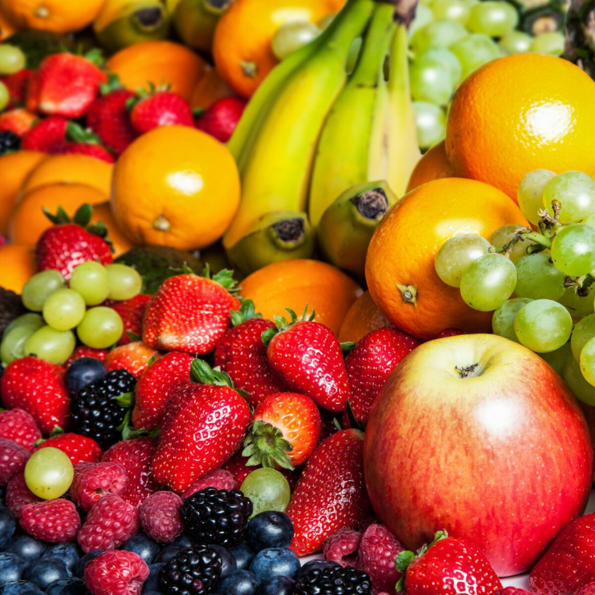

# DietAddict

DietAddict is a project of tracking calorie application.

## Project build

This project was built using these technologies and languages.

- Flutter
- hooks_riverpod
- flutter_qr_bar_scanner
- table_calendar
- Dart
- Firebase
- [Open Food Facts Database](https://world.openfoodfacts.org)

## About Me

I have 2 years of experience working on various data engineering projects, my experience includes:

- Designing and implementing data pipelines to extract, transform, and load (ETL) data from multiple sources.
- Optimizing database performance and ensuring data quality and integrity.
- Collaborating with cross-functional teams to understand data requirements and deliver actionable insights.
- Exploring new technologies and tools to enhance data processing efficiency and scalability.

In addition to my career as a data engineer, I have a keen interest in interface development. I believe that the combination of data expertise and intuitive user interfaces is crucial for creating impactful and user-centric data-driven solutions.

## Contact Me

- Email: aristide.pichereau@gmail.com
- LinkedIn: [ApichPro](https://www.linkedin.com/in/apichpro/)
- Website: [ApichPro](https://apichpro.github.io/portfolio/)

Feel free to reach out to discuss collaboration opportunities or if you have any questions about my projects and works!